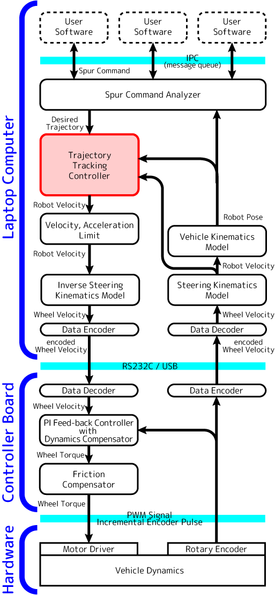
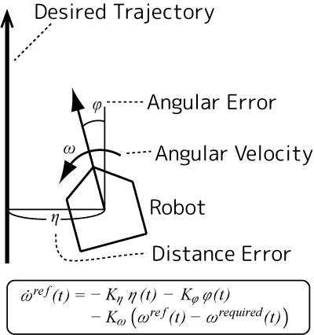

The following figure shows a control diagram of YP-Spur.

Trajectory tracking controller is expressed by:

The original idea of the control approach is reported in [1-3].

* [1] S. Yuta, Y. Kanayama. An implementation of MICHI - A locomotion command system for intelligent mobile robot, in Proc. of International Conference on Advanced Robotics, pp. 127-134, 1985
* [2] S. Iida, S. Yuta, Control of Vehicle with Power Wheeled Steerings Using Feed-forward Dynamics Compensation , in Proc. of Annual Conference on the IEEE Industrial Electronics Society, pp. 2264-2269, 1991
* [3] 飯田重喜, 油田信一. 車輪型移動ロボットのための走行制御コマンド系と軌跡制御方式, in Proc. of 第1 回日本ロボット学会ロボットシンポジウム, pp. 85-90, 1991
